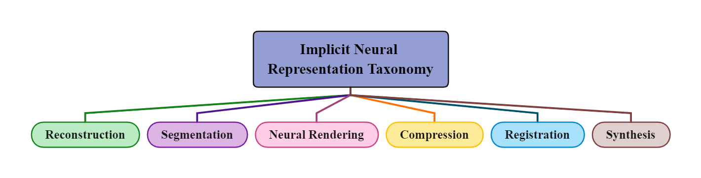

# Implicit Neural Representation in Medical Imaging: A Comparative Survey <br> <span style="float: right"><sub><sup>$\text{(\textcolor{#15babc}{ICCV 2023 CVAMD Workshop})}$</sup></sub></span> 


[](https://github.com/sindresorhus/awesome)
[](https://opensource.org/licenses/MIT)
[](https://makeapullrequest.com)

:fire::fire: This is a collection of awesome articles about Implicit Neural Representation networks in medical imaging:fire::fire:

:loudspeaker: Our review paper published on arXiv: [Implicit Neural Representation in Medical Imaging: A Comparative Survey](https://arxiv.org/abs/2307.16142) :heart:

#### Citation

```python
@article{molaei2023implicit,
  title={Implicit Neural Representation in Medical Imaging: A Comparative Survey},
  author={Molaei, Amirali and Aminimehr, Amirhossein and Tavakoli, Armin and Kazerouni, Amirhossein and Azad, Bobby and Azad, Reza and Merhof, Dorit},
  journal={arXiv preprint arXiv:2307.16142},
  year={2023}
}
```

# Introduction 

Implicitly representing image signals has gained popularity in recent years for a broad range of medical imaging applications.
The most motivating reasons are the following:
* Memory efficiency: The amount of memory demanded to represent the signal is not restricted by the signal's resolution.
* Unlimited Resolution: They take values in the continuous domain, meaning they can generate values for coordinates in-between the pixel or voxel-wise grid
* Effective data usage: They can learn to handle reconstruction and synthesis tasks without high-cost external annotation.

Which all are significantly important for developing an automatic medical system.<br>
With the aim of providing easier access for researchers, this repo contains a comprehensive paper list of Implicit Neural Representations in Medical Imaging, including papers, codes, and related websites.<br>
We considered a sum of <ins>**73**</ins> research papers spanning from 2021 to 2023.

---
# Introductory Papers
**Implicit Neural Representations with Periodic Activation Functions.** [17th Jun., 2020] [Advances in Neural Information Processing Systems, 2020]<br>
*Vincent Sitzmann, Julien N. P. Martel, Alexander W. Bergman, David B. Lindell, Gordon Wetzstein.*<br>
 [[PDF](https://arxiv.org/abs/2006.09661)]

**NeRF: Representing Scenes as Neural Radiance Fields for View Synthesis.** [19th Mar., 2020] [Communications of the ACM, 2021]<br>
*Ben Mildenhall, Pratul P. Srinivasan, Matthew Tancik, Jonathan T. Barron, Ravi Ramamoorthi, Ren Ng.*<br>
[[PDF](https://dl.acm.org/doi/abs/10.1145/3503250)]

---
# Main papers

Here, we taxonomize studies that integrate implicit representations into building medical analysis models.<br>

- [Image Segmentation](#image-segmentation)
- [Image Reconstruction](#image-reconstruction)
- [Image Registration](#image-registration)
- [Neural Rendering](#neural-rendering)
- [Image Compression](#image-compression)
- [Image Synthesis](#image-synthesis)


<br>
## Image Reconstruction

 **IntraTomo: Self-supervised Learning-based Tomography via Sinogram Synthesis and Prediction.** [9th Feb., 2021] [Proceedings of the IEEE/CVF International Conference on Computer Vision, 2021]<br>
*Guangming Zang, Ramzi Idoughi, Rui Li, Peter Wonka, Wolfgang Heidrich.*<br>
 [[PDF](https://neuralfields.cs.brown.edu/paper_243.html)]
 
 **CoIL: Coordinate-based Internal Learning for Imaging Inverse Problems.** [9th Feb., 2021] [IEEE Transactions on Computational Imaging, 2021]<br>
*Yu Sun, Jiaming Liu, Mingyang Xie, Brendt Wohlberg, Ulugbek S. Kamilov.*<br>
 [[PDF](https://arxiv.org/abs/2102.05181)] [[Github](https://github.com/wustl-cig/Cooridnate-based-Internal-Learning)]
 
 **ImplicitVol: Sensorless 3D Ultrasound Reconstruction with Deep Implicit Representation.** [24th Sep., 2021] [arXiv, 2021]<br>
*Pak-Hei Yeung, Linde Hesse, Moska Aliasi, Monique Haak, the INTERGROWTH-21st Consortium, Weidi Xie, Ana I.L. Namburete.*<br>
 [[PDF](https://arxiv.org/abs/2109.12108)] 

 **Going Off-Grid: Continuous Implicit Neural Representations for 3D Vascular Modeling.** [16th Sep., 2022] [arXiv preprint, 2022]<br>
*Dieuwertje Alblas, Christoph Brune, Kak Khee Yeung, Jelmer M. Wolterink.*<br>
[[PDF](https://arxiv.org/abs/2207.14663)]

 **Joint Rigid Motion Correction and Sparse-View CT via Self-Calibrating Neural Field.** [23th Oct., 2022] [arXiv, 2022]<br>
*Qing Wu, Xin Li, Hongjiang Wei, Jingyi Yu, Yuyao Zhang.*<br>
 [[PDF](https://arxiv.org/abs/2210.12731)] 

**An Arbitrary Scale Super-Resolution Approach for 3-Dimensional Magnetic Resonance Image using Implicit Neural Representation.** [29th Oct., 2021] [arXiv preprint, 2021]<br>
*Qing Wu, Yuwei Li, Yawen Sun, Yan Zhou, Hongjiang Wei, Jingyi Yu, Yuyao Zhang.*<br>
 [[PDF](https://arxiv.org/abs/2110.14476)] [[Github](https://github.com/iwuqing/arssr)]

**NeRP: Implicit Neural Representation Learning with Prior Embedding for Sparsely Sampled Image Reconstruction.** [24th Aug., 2021] [IEEE Transactions on Neural Networks and Learning Systems, 2022]<br>
*Liyue Shen, John Pauly, Lei Xing.*<br>
 [[PDF](https://arxiv.org/abs/2108.10991)]  [[Github](https://github.com/liyues/nerp)]

 
**Dynamic CT Reconstruction from Limited Views with Implicit Neural Representations and Parametric Motion Fields.** [23th Apr., 2021] [Proceedings of the IEEE/CVF International Conference on Computer Vision, 2021]<br>
*Albert W. Reed, Hyojin Kim, Rushil Anirudh, K. Aditya Mohan, Kyle Champley, Jingu Kang, Suren Jayasuriya.*<br>
 [[PDF](https://arxiv.org/abs/2104.11745)]
 
**IREM: High-Resolution Magnetic Resonance (MR) Image Reconstruction via Implicit Neural Representation.** [29th Jun., 2021] [International Conference on Medical Image Computing and Computer-Assisted Intervention, 2021]<br>
*Qing Wu, Yuwei Li, Lan Xu, Ruiming Feng, Hongjiang Wei, Qing Yang, Boliang Yu, Xiaozhao Liu, Jingyi Yu, Yuyao Zhang.*<br>
 [[PDF](https://arxiv.org/abs/2106.15097)]
 
**Streak artifacts reduction algorithm using an implicit neural representation in sparse-view CT.** [4th Apr., 2022] [Medical Imaging 2022: Physics of Medical Imaging, 2022]<br>
*Byeongjoon Kim, Hyunjung Shim, Jongduk Baek.*<br>
 [[PDF](https://www.spiedigitallibrary.org/conference-proceedings-of-spie/12031/120312N/Streak-artifacts-reduction-algorithm-using-an-implicit-neural-representation-in/10.1117/12.2610722.short)]
 
 **Representing 3D Ultrasound with Neural Fields.** [21th Apr., 2022] [Medical Imaging with Deep Learning, 2022]<br>
*Ang Nan Gu, Purang Abolmaesumi, Christina Luong, Kwang Moo Yi.*<br>
 [[PDF](https://openreview.net/forum?id=1EDRk-CyQou)]
 
 **A Memory-Efficient Dynamic Image Reconstruction Method using Neural Fields.** [11th May., 2022] [arXiv, 2022]<br>
*Luke Lozenski, Mark A. Anastasio, Umberto Villa.*<br>
 [[PDF](https://arxiv.org/abs/2205.05585?context=eess)] 


**UncertaINR: Uncertainty Quantification of End-to-End Implicit Neural Representations for Computed Tomography.** [3th Jun., 2022] [arXiv preprint, 2022]<br>
*Francisca Vasconcelos, Bobby He, Nalini Singh, Yee Whye Teh.*<br>
 [[PDF](https://arxiv.org/abs/2202.10847)] [[Github](https://github.com/bobby-he/uncertainr)]

**MRI Super-Resolution using Implicit Neural Representation with Frequency Domain Enhancement.** [Aug., 2022] [arXiv preprint, 2022]<br>
*Shuangming Mao, Seiichiro Kamata.*<br>
 [[PDF](https://dl.acm.org/doi/10.1145/3563737.3563759)]

**Dynamic Cone-beam CT Reconstruction using Spatial and Temporal Implicit Neural Representation Learning (STINR).** [Sep., 2022] [Physics in Medicine and Biology, 2023]<br>
*You Zhang, Hua-Chieh Shao, Tinsu Pan, Tielige Mengke.*<br>
 [[PDF](https://pubmed.ncbi.nlm.nih.gov/36638543/)]

**NeSVoR: Implicit Neural Representation for Slice-to-Volume Reconstruction in MRI.** [IEEE TRANSACTIONS ON MEDICAL IMAGING, 2022]<br>
*Junshen Xu, Daniel Moyer, Borjan Gagoski, Juan Eugenio Iglesias, P. Ellen Grant, Polina Golland,Elfar Adalsteinsson.*<br>
 [[PDF](https://www.techrxiv.org/articles/preprint/NeSVoR_Implicit_Neural_Representation_for_Slice-to-Volume_Reconstruction_in_MRI/21398868)] [[Github](https://github.com/daviddmc/NeSVoR)]

 **Unsupervised Polychromatic Neural Representation for CT Metal Artifact Reduction.** [27th Jun., 2023] [arXiv preprint]<br>
 *Qing Wu, Lixuan Chen, Ce Wang, Hongjiang Wei, S. Kevin Zhou, Jingyi Yu, Yuyao Zhang.*<br>
 [[PDF](https://arxiv.org/abs/2306.15203)]

 **Topology-Preserving Shape Reconstruction and Registration via Neural Diffeomorphic Flow.** [16th Mar., 2022] [Proceedings of the IEEE/CVF Conference on CVPR]
 *Shanlin Sun, Kun Han, Deying Kong, Hao Tang, Xiangyi Yan, Xiaohui Xie.*<br>
 [[PDF](https://arxiv.org/abs/2203.08652)] [[Github](https://github.com/Siwensun/Neural_Diffeomorphic_Flow--NDF)]

**Spatiotemporal implicit neural representation for unsupervised dynamic MRI reconstruction.** [31th Dec 2022] [arXiv preprint]
*Jie Feng, Ruimin Feng, Qing Wu, Zhiyong Zhang, Yuyao Zhang, Hongjiang Wei.*<br>
[[PDF](https://arxiv.org/abs/2301.00127)]

**Spatial Attention-based Implicit Neural Representation for Arbitrary Reduction of MRI Slice Spacing.** [23th May., 2022] [arXiv preprint]<br>
*Xin Wang, Sheng Wang, Honglin Xiong, Kai Xuan, Zixu Zhuang, Mengjun Liu, Zhenrong Shen, Xiangyu Zhao, Lichi Zhang, Qian Wang.*<br>
[[PDF](https://arxiv.org/abs/2205.11346)]

**Self-Supervised Coordinate Projection Network for Sparse-View Computed Tomography.** [12th Sep., 2022] [IEEE Transactions on Computational Imaging, 2023]<br>
*Qing Wu, Ruimin Feng, Hongjiang Wei, Jingyi Yu, Yuyao Zhang.*<br>
[[PDF](https://ieeexplore.ieee.org/document/10143286)] [[Github](https://github.com/iwuqing/SCOPE)]

**Self-supervised arbitrary scale super-resolution framework for anisotropic MRI.** [2th May., 2023] [arXiv preprint]<br>
*Haonan Zhang, Yuhan Zhang, Qing Wu, Jiangjie Wu, Zhiming Zhen, Feng Shi, Jianmin Yuan, Hongjiang Wei, Chen Liu, Yuyao Zhang.*<br>
[[PDF](https://arxiv.org/abs/2305.01360)]


**OReX: Object Reconstruction from Planar Cross-sections Using Neural Fields.** [23th Nov., 2022] [CVPR, 2023]<br>
*Haim Sawdayee, Amir Vaxman, Amit H. Bermano.*<br>
[[PDF](https://arxiv.org/abs/2211.12886)] [[Github](https://github.com/haimsaw/OReX)]

**NeuRec: Incorporating Interpatient prior to Sparse-View Image Reconstruction for Neurorehabilitation.** [21th Feb., 2022] [BioMed Research International, 2022]<br>
*Cong Liu, Qingbin Wang, Jing Zhang.*<br>
[[PDF](https://www.hindawi.com/journals/bmri/2022/5426643/)]

**Neural Implicit k-Space for Binning-free Non-Cartesian Cardiac MR Imaging.** [16th Dec., 2022] [International Conference on Information Processing in Medical Imaging, 2023] <br>
*Wenqi Huang, Hongwei Li, Jiazhen Pan, Gastao Cruz, Daniel Rueckert, Kerstin Hammernik.* <br>
[[PDF](https://arxiv.org/abs/2212.08479)]

**Neural Computed Tomography.** [17th Jan., 2022] [arXiv preprint, 2022]<br>
*Kunal Gupta, Brendan Colvert, Francisco Contijoch.* <br>
[[PDF](https://arxiv.org/abs/2201.06574)] [[Github](https://github.com/KunalMGupta/DIFIR-CT)]

**Implicitatlas: learning deformable shape templates in medical imaging.** [CVPR, 2022]<br>
*Jiancheng Yang, Udaranga Wickramasinghe, Bingbing Ni, Pascal Fua.*<br>
[[PDF](https://openaccess.thecvf.com/content/CVPR2022/html/Yang_ImplicitAtlas_Learning_Deformable_Shape_Templates_in_Medical_Imaging_CVPR_2022_paper.html)]

**Continuous longitudinal fetus brain atlas construction via implicit neural representation.** [14th Sep., 2022] [PIPPI, 2022]<br>
*Lixuan Chen, Jiangjie Wu, Qing Wu, Hongjiang Wei, Yuyao Zhang.*<br>
[[PDF](https://arxiv.org/abs/2209.06413)]

**ImTooth: Neural Implicit Tooth for Dental Augmented Reality.** [23rd Feb., 2023] [IEEE Transactions on Visualization and Computer Graphics, 2023]<br>
*Hai Li , Hongjia Zhai , Xingrui Yang , Zhirong Wu , Jianchao Wu , Hujun Bao , Yihao Zheng , Haofan Wang , Guofeng Zhang.*<br>
[[PDF](https://ieeexplore.ieee.org/document/10051634)]

**NAISR: A 3D Neural Additive Model for Interpretable Shape Representation.** [16th Mar., 2023] [arXiv preprint]<br>
*Yining Jiao, Carlton Zdanski, Julia Kimbell, Andrew Prince, Cameron Worden, Samuel Kirse, Christopher Rutter, Benjamin Shields, William Dunn, Jisan Mahmud, Marc Niethammer.*<br>
[[PDF](https://arxiv.org/abs/2303.09234)] [[Github](https://github.com/uncbiag/naisr)]

**Multi-contrast MRI Super-resolution via Implicit Neural Representations.** [27th Mar., 2023] [arXiv preprint]<br>
*Julian McGinnis, Suprosanna Shit, Hongwei Bran Li, Vasiliki Sideri-Lampretsa, Robert Graf, Maik Dannecker, Jiazhen Pan, Nil Stolt Ansó, Mark Mühlau, Jan S. Kirschke, Daniel Rueckert, Benedikt Wiestler.*<br>
[[PDF](https://arxiv.org/abs/2303.15065)] [[Github](https://github.com/jqmcginnis/multi_contrast_inr)]

**MiShape: 3D Shape Modelling of Mitochondria in Microscopy.** [2nd Mar., 2023] [arXiv preprint]<br>
*Abhinanda R. Punnakkal, Suyog S Jadhav, Alexander Horsch, Krishna Agarwal, Dilip K. Prasad.*<br>
[[PDF](https://arxiv.org/abs/2303.01546)]

**Learning Deep Intensity Field for Extremely Sparse-View CBCT Reconstruction.** [12th Mar., 2023] [arXiv preprint]<br>
*Yiqun Lin, Zhongjin Luo, Wei Zhao, Xiaomeng Li.*<br>
[[PDF](https://arxiv.org/abs/2303.06681)] [[Github](https://github.com/xmed-lab/dif-net)]

**MEPNet: A Model-Driven Equivariant Proximal Network for Joint Sparse-View Reconstruction and Metal Artifact Reduction in CT Images.** [25th Jun., 2023] [arXiv preprint]<br>
*Hong Wang, Minghao Zhou, Dong Wei, Yuexiang Li, Yefeng Zheng.*<br>
[[PDF](https://ui.adsabs.harvard.edu/abs/2023arXiv230614274W/abstract)] [[Github](https://github.com/hongwang01/mepnet)]

**A Novel Implicit Neural Representation for Volume Data.** [27th Feb., 2023] [Applied Sciences, 2023]<br>
*Armin Sheibanifard, Hongchuan Yu.*<br>
[[PDF](https://www.mdpi.com/2076-3417/13/5/3242)]

**A scan-specific unsupervised method for parallel MRI reconstruction via implicit neural representation.** [19th Oct., 2022] [arXiv preprint]<br>
*Ruimin Feng, Qing Wu, Yuyao Zhang, Hongjiang Wei.*<br>
[[PDF](https://arxiv.org/abs/2210.10439)]

**CuNeRF: Cube-Based Neural Radiance Field for Zero-Shot Medical Image Arbitrary-Scale Super Resolution.** [28th Mar., 2023] [arXiv preprint]<br>
*Zixuan Chen, Jianhuang Lai, Lingxiao Yang, Xiaohua Xie.*<br>
[[PDF](https://arxiv.org/abs/2303.16242)]

**Hybrid Neural Diffeomorphic Flow for Shape Representation and Generation via Triplane.** [4th Jul., 2023] [arXiv preprint]<br>
*Kun Han, Shanlin Sun, Xiaohui Xie.*<br>
[[PDF](https://arxiv.org/abs/2307.01957)]

**Dual Arbitrary Scale Super-Resolution for Multi-Contrast MRI.** [5th Jul., 2023] [arXiv preprint]<br>
*Jiamiao Zhang, Yichen Chi, Jun Lyu, Wenming Yang, Yapeng Tian.*<br>
[[PDF](https://arxiv.org/abs/2307.02334)] [[Github](https://github.com/jmzhang79/dual-arbnet)]

**Implicit Neural Networks with Fourier-Feature Inputs for Free-breathing Cardiac MRI Reconstruction.** [11th May., 2023] [arXiv preprint]<br>
*Johannes F. Kunz, Stefan Ruschke, Reinhard Heckel.*<br>
[[PDF](https://arxiv.org/abs/2305.06822)] [[Github](https://github.com/mli-lab/cinemri)]

**Implicit neural representations for unsupervised super-resolution and denoising of 4D flow MRI.** [24th Feb., 2023] [arXiv preprint]<br>
*Simone Saitta, Marcello Carioni, Subhadip Mukherjee, Carola-Bibiane Schönlieb, Alberto Redaelli.*<br>
[[PDF](https://arxiv.org/abs/2302.12835)]

**Hybrid-CSR: Coupling Explicit and Implicit Shape Representation for Cortical Surface Reconstruction.** [23rd Jul., 2023][arXiv]<br>
*Shanlin Sun, Thanh-Tung Le, Chenyu You, Hao Tang, Kun Han, Haoyu Ma, Deying Kong, Xiangyi Yan, Xiaohui Xie.*<br>
[[PDF](https://arxiv.org/abs/2307.12299)]


<br>
<br>
## Image Segmentation

**NeRD: Neural Representation of Distribution for Medical Image Segmentation.** [6th Mar., 2021] [arXiv preprint, 2021]<br>
*Hang Zhang, Rongguang Wang, Jinwei Zhang, Chao Li, Gufeng Yang, Pascal Spincemaille, Thanh Nguyen, Yi Wang.*<br>
 [[PDF](https://arxiv.org/abs/2103.04020)]
 
**Binary segmentation of medical images using implicit spline representations and deep learning.** [19th Mar., 2021] [Computer Aided Geometric Design, 2021]<br>
*Oliver J.D. Barrowclough, Georg Muntingh, Varatharajan Nainamalai, Ivar Stangeby.*<br>
 [[PDF](https://arxiv.org/abs/2102.12759)] [[Github](https://github.com/sintefmath/implicit-recon)]

 **Implicit field learning for unsupervised anomaly detection in medical images.** [9th Jun., 2021] [MICCAI 2021]<br>
*Sergio Naval Marimont, Giacomo Tarroni.*<br>
[[PDF](https://arxiv.org/abs/2106.05214)] [[Github](https://github.com/snavalm/ifl_unsup_anom_det)]
 
**Implicit Neural Representations for Medical Imaging Segmentation.** [16th Sep., 2022] [International Conference on Medical Image Computing and Computer-Assisted Intervention, 2022]<br>
*Muhammad Osama Khan & Yi Fang.*<br>
 [[PDF](https://link.springer.com/chapter/10.1007/978-3-031-16443-9_42)] 
 
 
**Retinal vessel segmentation based on self-distillation and implicit neural representation.** [8th Nov., 2022] [Applied Intelligence, 2022]<br>
*Jia Gu, Fangzheng Tian & Il-Seok Oh.*<br>
 [[PDF](https://link.springer.com/article/10.1007/s10489-022-04252-2)] 

 **Deep Implicit Statistical Shape Models for 3D Medical Image Delineation** [28th Jun., 2022] [AAAI, 2022]<br>
*Ashwin Raju, Shun Miao, Dakai Jin, Le Lu, Junzhou Huang, Adam P. Harrison*<br>
 [[PDF]( https://arxiv.org/abs/2104.02847)] [[Github](https://github.com/ashstuff/dissm)]

**Direct localization and delineation of human pedunculopontine nucleus based on a self-supervised magnetic resonance image super-resolution method** [25 th Apr., 2023] [Human Brain Mapping, 2023]<br>
*Jun Li, Xiaojun Guan, Qing Wu, Chenyu He, Weimin Zhang, Xiyue Lin, Chunlei Liu, Hongjiang Wei, Xiaojun Xu, Yuyao Zhang*<br>
[[PDF](https://onlinelibrary.wiley.com/doi/full/10.1002/hbm.26311)]

**Implicit Anatomical Rendering for Medical Image Segmentation with Stochastic Experts** [6th Apr., 2023] [arXiv preprint, 2023]<br>
*Chenyu You, Weicheng Dai, Yifei Min, Lawrence Staib, James S. Duncan*<br>
 [[PDF]( https://arxiv.org/abs/2304.03209)] [[Github](https://github.com/charlesyou999648/morse)]

**SwIPE: Efficient and Robust Medical Image Segmentation with Implicit Patch Embeddings** [23rd Jul., 2023] [MICCAI 2023]<br>
*Yejia Zhang, Pengfei Gu, Nishchal Sapkota, Danny Z. Chen*<br>
[[PDF](https://arxiv.org/abs/2307.12429)]

<br>
<br>
## Image Registration

**Implicit Neural Representations for Deformable Image Registration.** [22th Jun., 2022] [Medical Imaging with Deep Learning, 2022]<br>
*Jelmer M. Wolterink, Jesse C. Zwienenberg, Christoph Brune.*<br>
 [[PDF](https://openreview.net/forum?id=BP29eKzQBu3)] [[Github](https://github.com/MIAGroupUT/IDIR)]
 
**Medical Image Registration via Neural Fields.** [22th Jun., 2022] [arXiv, 2022]<br>
*Shanlin Sun, Kun Han, Hao Tang, Deying Kong, Junayed Naushad, Xiangyi Yan, Xiaohui Xie.*<br>
 [[PDF](https://arxiv.org/abs/2206.03111)]

 **Learning Homeomorphic Image Registration via Conformal-Invariant Hyperelastic Regularisation** [30 th Jun., 2023 ] [arXiv preprint, 2023 ]<br>
*Jing Zou, Noémie Debroux, Lihao Liu, Jing Qin, Carola-Bibiane Schönlieb, Angelica I Aviles-Rivero*<br>
 [[PDF]( https://arxiv.org/abs/2303.08113)] 

**Diffeomorphic Image Registration with Neural Velocity Field** [2023] [IEEE/CVF Winter Conference on Applications of Computer Vision, 2023]<br>
*Kun Han, Shanlin sun, Xiangyi Yan, Chenyu You, Hao Tang, Junayed Naushad, Haoyu Ma, Deying Kong, Xiaohui Xie*<br>
 [[PDF]( https://arxiv.org/abs/2202.12498)]

 **Deformable Image Registration with Geometry-informed Implicit Neural Representations** [13 th Apr., 2023] [Medical Imaging with Deep Learning, 2023]<br>
*Louis van Harten, Rudolf Leonardus Mirjam Van Herten, Jaap Stoker, Ivana Isgum*<br>
[[PDF](https://openreview.net/forum?id=Pj9vtDIzSCE)]

**Implicit neural representations for joint decomposition and registration of gene expression images in the marmoset brain.** [8th Aug., 2023] [arxiv preprint]<br>
*Michal Byra, Charissa Poon, Tomomi Shimogori, Henrik Skibbe*<br>
[[PDF](https://arxiv.org/abs/2308.04039)]

**INR-LDDMM: Fluid-based Medical Image Registration Integrating Implicit Neural Representation and Large Deformation Diffeomorphic Metric Mapping.** [18th Aug., 2023] [arxiv]<br>
*Chulong Zhang, Xiaokun Liang.*<br>
[[PDF](https://arxiv.org/abs/2308.09473)]


<br>
<br>
## Neural Rendering

**MedNeRF: Medical Neural Radiance Fields for Reconstructing 3D-aware CT-Projections from a Single X-ray.** [2nd Feb., 2022] [IEEE EMBC, 2022]<br>
*Abril Corona-Figueroa, Jonathan Frawley, Sam Bond-Taylor, Sarath Bethapudi, Hubert P. H. Shum, Chris G. Willcocks.*<br>
 [[PDF](https://arxiv.org/abs/2202.01020)] [[Github](https://github.com/abrilcf/mednerf)]

 **Neural Rendering for Stereo 3D Reconstruction of Deformable Tissues in Robotic Surgery.** [30th Jun., 2022] [MICCAI, 2022]<br>
*Yuehao Wang, Yonghao Long, Siu Hin Fan, Qi Dou.*<br>
 [[PDF](https://arxiv.org/abs/2206.15255)] [[Github](https://github.com/med-air/endonerf)]
 
 **NAF: Neural Attenuation Fields for Sparse-View CBCT Reconstruction.** [29th Sep., 2022] [	MICCAI, 2022]<br>
*Ruyi Zha, Yanhao Zhang, Hongdong Li.*<br>
 [[PDF](https://arxiv.org/abs/2209.14540)] [[Github](https://github.com/ruyi-zha/naf_cbct)]

 **SNAF: Sparse-view CBCT Reconstruction with Neural Attenuation Fields.** [30th Nov., 2022] [	arXiv preprint, 2022]<br>
*Yu Fang, Lanzhuju Mei, Changjian Li, Yuan Liu, Wenping Wang, Zhiming Cui, Dinggang Shen.*<br>
[[PDF](https://arxiv.org/abs/2211.17048)]

**Ultra-NeRF: Neural Radiance Fields for Ultrasound Imaging.** [25th Jan., 2023] [MIDL, 2023]<br>
*Magdalena Wysocki, Mohammad Farid Azampour, Christine Eilers, Benjamin Busam, Mehrdad Salehi, Nassir Navab.*<br>
[[PDF](https://arxiv.org/abs/2301.10520)]

**Oral-NeXF: 3D Oral Reconstruction with Neural X-ray Field from Panoramic Imaging.** [21st Mar., 2023] [arxiv] <br>
*Weinan Song, Haoxin Zheng, Jiawei Yang, Chengwen Liang, Lei He.*<br>
[[PDF](https://arxiv.org/abs/2303.12123)]

 **3D reconstructions of brain from MRI scans using neural radiance fields.** [24th Apr., 2023] [Preprint, 2023]<br>
*Khadija Iddrisu, Sylwia Malec, Alessandro Crimi.*<br>
 [[PDF](https://www.biorxiv.org/content/10.1101/2023.04.24.538160v1#:~:text=The%20development%20of%20neural%20radiance,2D%20slices%20of%20MRI%20scans.)]

 **EndoSurf: Neural Surface Reconstruction of Deformable Tissues with Stereo Endoscope Videos.** [21st Jul., 2023] [MICCAI 2023]<br>
 *Ruyi Zha, Xuelian Cheng, Hongdong Li, Mehrtash Harandi, Zongyuan Ge.*<br>
 [[PDF](https://arxiv.org/abs/2307.11307)] [[Github](https://github.com/ruyi-zha/endosurf)]

 **Robust Single-view Cone-beam X-ray Pose Estimation with Neural Tuned Tomography (NeTT) and Masked Neural Radiance Fields (mNeRF).** [1st Aug., 2023] [arxiv] <br>
*Chaochao Zhou, Syed Hasib Akhter Faruqui, Abhinav Patel, Ramez N. Abdalla, Michael C. Hurley, Ali Shaibani, Matthew B. Potts, Babak S. Jahromi, Leon Cho, Sameer A. Ansari, Donald R. Cantrell.*<br>
[[PDF](https://arxiv.org/abs/2308.00214)]

 
<br>
<br> 
## Image Compression

**SCI: A Spectrum Concentrated Implicit Neural Compression for Biomedical Data.** [23th Nov., 2022] [AAAI, 2023]<br>
*Runzhao Yang, Tingxiong Xiao, Yuxiao Cheng, Qianni Cao, Jinyuan Qu, Jinli Suo, Qionghai Dai.*<br>
 [[PDF](https://arxiv.org/abs/2209.15180)] [[Github](https://github.com/MIAGroupUT/IDIR)]
 
**TINC: Tree-structured Implicit Neural Compression.** [12th Nov., 2022] [arXiv, 2022]<br>
*Runzhao Yang, Tingxiong Xiao, Yuxiao Cheng, Jinli Suo, Qionghai Dai.*<br>
 [[PDF]()] [[Github](https://github.com/MIAGroupUT/IDIR)]

 **COIN++ Neural Compression Across Modalities** [8th Dec ., 2022] [arXiv preprint, 2022]<br>
*Emilien Dupont, Hrushikesh Loya, Milad Alizadeh, Adam Goliński, Yee Whye Teh, Arnaud Doucet*<br>
 [[PDF]( https://arxiv.org/abs/2201.12904)] 

 **SINCO: A Novel structural regularizer for image compression using implicit neural representations** [5th May., 2023] [IEEE International Conference on Acoustics, Speech and Signal Processing, 2023]<br>
*Harry Gao, Weijie Gan, Zhixin Sun, Ulugbek S. Kamilov*<br>
 [[PDF]( https://arxiv.org/abs/2210.14974)]

<br> 
<br> 
 ## Image Synthesis

**Implicit Neural Representations for Generative Modeling of Living Cell Shapes.** [6th Oct., 2022] [International Conference on Medical Image Computing and Computer-Assisted Intervention, 2022]<br>
*David Wiesner, Julian Suk, Sven Dummer, David Svoboda, Jelmer M. Wolterink.*<br>
 [[PDF](https://arxiv.org/abs/2207.06283)] 

**Generative modeling of living cells with SO(3)-equivariant implicit neural representations.** [18 th Apr., 2023] [arXiv preprint, 2023]<br>
*David Wiesner, Julian Suk, Sven Dummer, Tereza Nečasová, Vladimír Ulman, David Svoboda, Jelmer M. Wolterink*<br>
 [[PDF]( https://arxiv.org/abs/2304.08960)]


 


